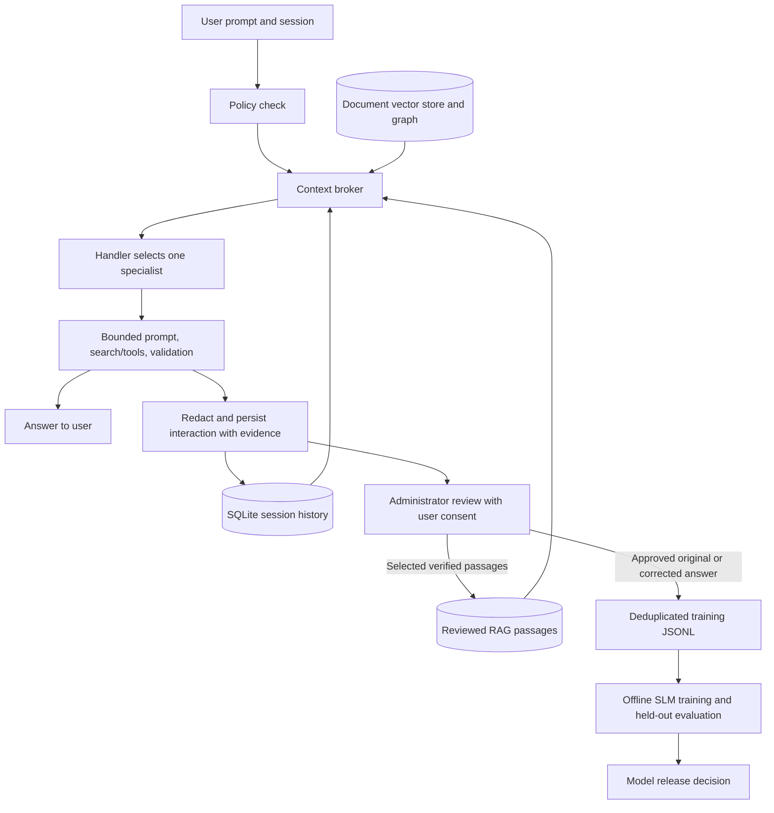

# Memory, context, RAG, and SLM learning

The answer path and the learning path share evidence, but have separate trust boundaries.
Search results and model answers are candidates, not automatically verified facts.



## Running it

Set these environment variables before starting the API:

```dotenv
CYBERAGENT_LEARNING_DB_PATH=data/learning.sqlite3
CYBERAGENT_LEARNING_ADMIN_TOKEN=replace-with-a-long-random-secret
CYBERAGENT_MEMORY_RECENT_TURNS=6
CYBERAGENT_MAX_CONTEXT_CHARS=20000
```

The SQLite file holds redacted interactions, retrieval snapshots, answer evidence,
consent flags, current review decisions, and review history. Writes finish before
the chat response returns. SQLite operations run on a worker thread with serialized
connection access. Back up this file using SQLite-aware backup procedures.
Use `:memory:` for isolated tests. Paths are relative to the process working directory.

Chat requests support:

```json
{
  "message": "How do we rotate access tokens?",
  "tenant_id": "acme",
  "session_id": "session-42",
  "retain_interaction": true,
  "training_consent": true,
  "rag_consent": true
}
```

Retention defaults to true; training and RAG consent default to false. Setting
`retain_interaction=false` skips both content capture and conversation-memory writes.
Metadata-only operational audit events still exist. Blocked/error responses are
retained for inspection but cannot be approved or recalled as completed dialogue.

## Review and reuse

All learning endpoints require `x-learning-key`, independent of the normal chat key.
They are disabled until the learning administrator token is configured.

1. `GET /v1/learning/interactions?tenant_id=acme&limit=100&offset=0`
   lists captured interactions and their evidence for review.
2. `POST /v1/learning/interactions/{request_id}/review` selects approved uses:

```json
{
  "tenant_id": "acme",
  "reviewer": "reviewer-17",
  "note": "Checked against the authentication runbook, revision 5.",
  "training_approved": true,
  "rag_approved": true,
  "corrected_answer": "Issue the replacement, verify adoption, then revoke the old token.",
  "knowledge_text": "Token rotation: issue the replacement, verify adoption, then revoke the old token. Source: authentication runbook revision 5."
}
```

`knowledge_text` is required for RAG approval: select only verified, reusable text.
It is chunked with overlap and searched by lexical relevance, then merged with the
existing vector/graph retrieval path. It survives restarts without reindexing and
is visible across sessions within its tenant. The latest review replaces both approval
flags. Revocation immediately excludes the item from subsequent RAG queries/exports.

3. `GET /v1/learning/export?tenant_id=acme` downloads JSONL containing approved,
   consented, completed examples. Each row includes chat messages, model provenance,
   source context/evidence, a content hash, schema version, and a split label.
   Corrected answers replace originals in the messages. Exact prompt/answer pairs
   are deduplicated; normalized identical prompts share a deterministic split.

Export is dataset preparation, not execution of training. Your offline trainer
must use the context/evidence fields when training evidence-dependent tasks.
Before training, group related conversations/documents to prevent semantic leakage,
review for additional sensitive data, and evaluate factuality and task performance
against the current SLM on an independent held-out set. No weights are changed or
deployed automatically.

## Context and isolation

The broker retrieves recent completed turns under exact tenant/session keys,
reserves at most one third of its character allowance for them, then adds ranked
knowledge and graph context. References track snippets actually selected. The
specialist reconstructs the prompt within its budget; tool follow-ups and corrective
retries are also bounded. Shared harness objects no longer inject shared conversation
history. External knowledge remains untrusted prompt data.

Budgets are character based, with a 4,000-character output reserve and conservative
model-class limits. They are not exact tokenizer accounting; configure them for the
actual endpoint and language. Large user inputs can be truncated. Hash embeddings
are only an offline test adapter. For semantic document retrieval, configure the
existing real embedding endpoint and Qdrant backend. Direct `/v1/knowledge` documents
remain ephemeral with `memory_backend=memory`; use Qdrant for durable document vectors.

SQLite curated retrieval scans approved passages and suits a local deployment.
Large corpora should move this query behind an indexed retrieval adapter, preserving
the approval/revocation filter. Raw interaction retention has no automatic expiry.
Regex redaction covers common secrets, bearer tokens, private keys and emails; it is
not exhaustive de-identification.

Configure `CYBERAGENT_TENANT_API_KEYS_JSON` to bind each tenant ID to its own
API key. The global `CYBERAGENT_API_TOKEN` is an administrative credential and
can operate across tenants. Session IDs and consent still come from the trusted
application. The learning key operates across tenants, and reviewer names remain
operator-supplied audit labels.

Implementation references: [SQLite transactions](https://docs.python.org/3/library/sqlite3.html#how-to-use-the-connection-context-manager)
and [Qdrant payload filtering](https://qdrant.tech/documentation/search/filtering/).
